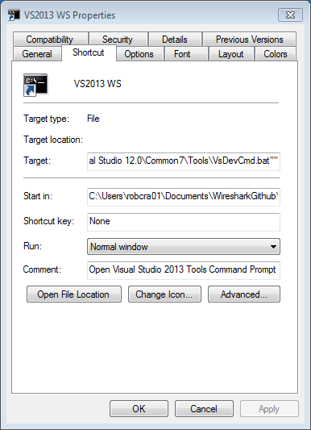
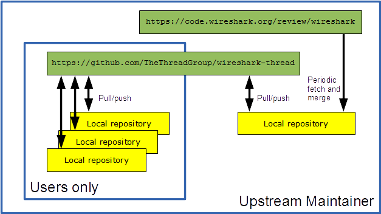

# Wireshark for Thread #

This document is a short summary for what is needed to build Wireshark from the `thread-wireshark` repository and how to use Git in conjunction with it.

**Note that as of 2015-09-21, the Thread Wireshark repository is officially hosted on Bitbucket (https://bitbucket.org/threadgroup/thread-wireshark).**

## Setting preferences for Thread Wireshark ##

**It is important to set the correct preferences for IEEE 802.15.4 or else it may stop with an assertion**

The preferences should be set as follows:


## Instructions for building using Windows ##

### Git and Bitbucket ###

The first thing to point out is that Git and Github are not the same thing and that Bitbucket is a replacement for Github, not Git. Bitbucket hosts projects as Git repositories, using Git "under the hood". As a result, Bitbucket can be used very effectively in conjunction with Git on your local PC using a cloned repository and that is the recommended way of working.

### Development tools ###

There is currently an attempt to move towards using `CMake` and away from `nmake` in Windows. This is harder to set up on Windows due to issues with PATH and environment variables so the recommendation is to still use `nmake`. The instructions for `nmake` building have however been replaced with those for `CMake` building, so [the instructions for `nmake` building from web.archive.org](http://web.archive.org/web/20150801215144/https://www.wireshark.org/docs/wsdg_html_chunked/ChSetupWin32.html) should be followed to set up the development environment.

A few notes:

* Chocolatey is optional
* We are not typically using Qt at the moment so it is not essential to install Qt
* Note carefully the issue about `link.exe` as that can catch you out.

The main difference is that in Section 2.2.8, **do not use the specified repository**. Instead, do:

    git clone git@bitbucket.org:threadgroup/thread-wireshark.git wireshark

This will clone the repository from the Thread Group Bitbucket site into a directory called `wireshark`. This includes all the patches required for Thread already incorporated into the source files.

Also, the environment variable setup has been put into a file called `vs2013cfg.bat`. You will need to alter this to change where your `WIRESHARK_BASE_DIR` is and possibly the `WIRESHARK_CYGWIN_INSTALL_PATH` for Cygwin.

If you do want to attempt to build using `CMake` on Windows, follow [these instructions](https://www.wireshark.org/docs/wsdg_html_chunked/ChSetupWin32.html) to set up the development environment. The environment variable setup file in this case is called `vs2013cmcfg.bat`.

### Command prompt for building ###

There are some convenient shortcuts set up here:

    C:\Program Files (x86)\Microsoft Visual Studio 12.0\Common7\Tools\Shortcuts

The "Developer Command Prompt for VS2013" shortcut can be used or copied and will set up the appropriate environment variables for executing the VS2013 tools. It is probably best to copy the shortcut, rename it and modify the properties so it starts up in your Wireshark directory:



### Checking installed tools ###

Using the Developer Command Prompt, run the following:

    nmake -f Makefile.nmake verify_tools

Check the tools paths look sensible. It should look something like this:

```
Can't find Qt. This will become a problem at some point.
Checking for required applications:
cl: /cygdrive/c/Program Files (x86)/Microsoft Visual Studio 12.0/VC/BIN/cl
link: /cygdrive/c/Program Files (x86)/Microsoft Visual Studio 12.0/VC/BIN/link
nmake: /cygdrive/c/Program Files (x86)/Microsoft Visual Studio 12.0/VC/BIN/nmake
bash: /usr/bin/bash
bison: /usr/bin/bison
flex: /usr/bin/flex
env: /usr/bin/env
grep: /usr/bin/grep
/usr/bin/find: /usr/bin/find
peflags: /usr/bin/peflags
perl: /usr/bin/perl
C:\Python27\python.exe: /cygdrive/c/Python27/python.exe
sed: /usr/bin/sed
unzip: /usr/bin/unzip
wget: /usr/bin/wget
```

Note especially where `link` and `perl` are pointing to as this can cause some issues. Also ensure that `python` is pointing to the Windows native version, **not** the Cygwin version in `/usr/bin`. If this is not the case, you may need to play around with path ordering.

### Building Wireshark ###

This is a repeat of [what is in here](http://web.archive.org/web/20150801215144/https://www.wireshark.org/docs/wsdg_html_chunked/ChSetupWin32.html) to some extent but highlights the general process.

Using the Developer Command Prompt, run the following:

    nmake -f Makefile.nmake setup

This brings all the libraries needed into a sibling directory called `wireshark-win32-libs`. To build Wireshark from scratch, run the following:

    nmake -f Makefile.nmake

Go and have a coffee; it will take some time!

#### Clean builds ####

Wireshark is a very complex build, involving lots of stages. Usually, just doing the following is enough to clean build:

    nmake -f Makefile.nmake clean

However, occasionally, a "cleaner" build is needed; this can be done by running:

    nmake -f Makefile.nmake maintainer-clean

## Instructions for building using CMake on Linux ##

Note: This may also work on Mac but has not been tested.

Look [here regarding Debian packaging](https://www.wireshark.org/docs/wsdg_html_chunked/ChSrcBinary.html):

    $ dpkg-buildpackage -rfakeroot -us -uc

When this is run, there may be a lot of missing dependencies. Install these:

    $ sudo apt-get install <tool>

* qttools5-dev
* qttools5-dev-tools
* python-ply
* libc-ares-dev
* xsltproc
* libcap2-dev
* quilt
* libparse-yapp-perl
* libgcrypt-dev
* libgnutls-dev
* portaudio19-dev
* libkrb5-dev
* liblua5.2-dev
* libsmi2-dev
* libgeoip-dev
* imagemagick
* libnl-genl-3-dev
* libnl-route-3-dev
* asciidoc
* w3m
* libsbc-dev

You should now be able to [build using CMake](https://code.wireshark.org/review/gitweb?p=wireshark.git;a=blob_plain;f=README.cmake). If it fails first time (due to some wiretap libgcrypt issue), type `make` again and it should complete this time.

If you need to do a complete rebuild having installed Wireshark, it is important to delete installed libraries:

    /usr/local/lib/libwsutil.so.*
    /usr/local/lib/libwireshark.so.*
    /usr/local/lib/libwiretap.so.*

and then re-running:

    $ sudo make install

## Using Git and Bitbucket ##

This section is more about how the Thread Wireshark repository works in conjunction with the Wireshark Git repository and gives guidance on how to submit changes.

### Git configuration ###

You will need to do the following to make Git work properly with Bitbucket Git repositories:

    git config user.name "John Doe"
    git config user.email "johndoe@example.com"
    git config push.default simple

If you want to make them global, add the `--global` flag:

    git config --global user.name "John Doe"
    git config --global user.email "johndoe@example.com"
    git config --global push.default simple

### Users and Upstream Maintainer ###

"Users" are those who wish to interact only with the Thread Wireshark repository and submit changes. The Upstream Maintainer is the person (typically only one person) who is tasked with pulling changes from the upstream repository to the Thread repository.

### Wireshark repository ###

Wireshark changes all the time with many fixes and additions on a daily basis. Therefore, it is important that regular synchronisation with the upstream is done to ensure that important fixes and changes are incorporated. The downside is that it is working on the "bleeding edge" and therefore it is possible that stability issues creep in, although the maintainers use Gerrit code review to ensure that all changes submitted are vetted first.

### User operation ###

Users will typically branch, make changes locally, commit to the branch and push. Users submit a pull request when a significant change needs to be merged into the master.

#### Branching ####

A tracking branch should be used. This means that a branch is also created on the Bitbucket repository that will track any changes made on the local repository. This is done by doing:

    git checkout --b owner/arm origin/owner/arm

where `owner/arm` is the name of the local branch and `origin/owner/arm` is the name of the branch on the remote repository (i.e. `thread-wireshark` repository on Bitbucket).

#### Modifying files ####

Files can be changed locally and Wireshark can be built to ensure it is working OK.

#### Committing changes ####

When Users are happy that the changes they have made are OK, they can commit them locally to that branch (which they will already be on). Users can (and should) do this often. It is bad practice to have unstaged and uncommitted files hanging around in a working directory. This an be done using:

    git add

to "stage" the changes for commit (basically allows a whole set of changes to be committed in one go) and then:

    git commit

which will open up an editor (usually Vim) prompting you for a comment, whih you can add using:

```
i
<comment text>
ESC
:wq<cr>
```
* `i` enters Vim insert mode
* `ESC` exits insert mode
* `:wq` writes and quits

#### Pushing changes and issuing a pull request ####

When Users are completely confident that their changes are good, they can push the changes to the remote repository:

    git push

This will cause the changes to appear on the remote branch but not the master branch.

Users will then typically issue a Bitbucket "pull request". This notifies everybody and especially the Upstream Maintainer, who will to merge in the changes to the master branch of the `thread-wireshark` repository and ensure that any conflicts are resolved.

### Upstream Maintainer operation ###

**This should only be undertaken by a single person who is coordinating changes to the Thread repository. Whilst others can do this, it may cause some synchronisation issues if not carefully managed.**

Performing the following additional Git commands links a local repository not only with an "origin" Git repository but also an "upstream" Git repository from which the intermediate repository is based on.

    git remote add upstream https://code.wireshark.org/review/wireshark
    git fetch upstream
    git merge upstream/master

This allows the latest Wireshark code to be merged in periodically. This should only be done by the Upstream Maintainer, who can fix any issues which may arise when merging. The Upstream Maintainer will then notify Users when this has been done so they can pull the latest changes. The Upstream Maintainer also manages the pull requests from Users.



Note rebasing is not being used as, whilst it can produce cleaner commit trees, it is inherently less safe. You will just have to get used to the unpleasant "tramlines" up to a merge. [This is a good tutorial]( https://www.atlassian.com/git/tutorials/merging-vs-rebasing/) explaining the differences.
